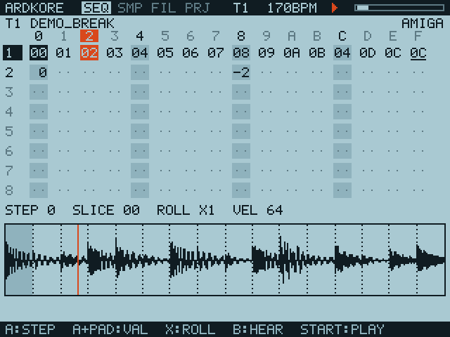
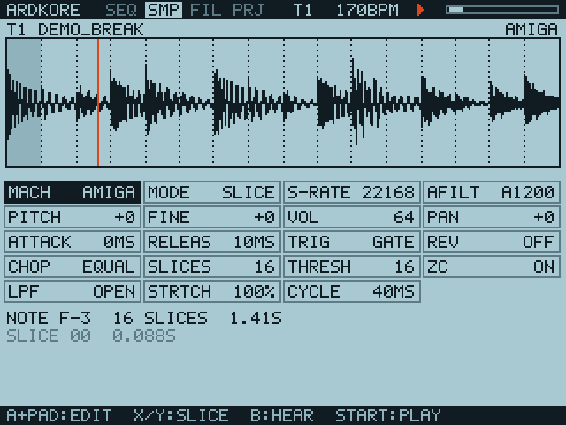

# ARDKORE

An 8-bit slice sampler groovebox for the Anbernic RG35XX SP (and other
handhelds running PortMaster). Chop breaks, crunch them through classic
sampler voicings, and sequence them with a gamepad.




## Features

- **8 tracks × 16 steps**, with per-step slice/note, velocity and roll (×2, ×3, ×4, ×6, ×8)
- **Slice mode**: equal divisions (1–32) or automatic transient detection (THRESH),
  with optional zero-crossing snap
- **Sample mode**: the whole sample played chromatically (±12 semitones per step)
- **Machine voicings** per track:

  | Machine | Bits | Rate | Playback | Output |
  |---|---|---|---|---|
  | AMIGA | 8 | ProTracker periods, C-1 4144 Hz … C-4 33149 Hz | no interpolation | A1200 / A500 RC (4.4 kHz) / A500 + LED (3.1 kHz) |
  | SP1200 | 12 | 26.04 kHz | no interpolation | tracks 1–2 four-pole LPF, 3–6 fixed LPF, 7–8 unfiltered |
  | MPC60 | 12 (companded) | 40 kHz | linear | gentle LPF |
  | MPC3000 | 16 | 44.1 kHz | linear | gentle LPF + soft saturation |
  | PS1 | 4-bit SPU-ADPCM | 5.5–44.1 kHz (incl. CD-XA 18.9/37.8 kHz) | SPU 4-point Gaussian, 4.12 pitch register | — |

  The vintage samplers are approximations to tune by ear. The PS1 voicing uses
  the documented SPU behaviour (psx-spx): real ADPCM encode/decode, the
  hardware Gaussian table and pitch-register quantisation.
- **PS1 pad synth**: built-in, seamlessly looping CHOIR, STRINGS, GLASS, SAW and
  SUB sources (additive, so loops have no seam) played through the PS1 voicing
- **Chords** per track (MAJ, MIN, 7ths, 9ths, MIN11, SUS…) with up to 8 voices;
  earlier chords fall into their release so pads overlap
- **PS1 SPU reverb** send bus with the factory presets (Room, Studio S/M/L, Hall,
  Half Echo, Space Echo, Chaos, Delay), running at 22.05 kHz like the hardware
- **LOOP**, **HOLD** (note length in steps), **SPEED** (track runs at 1/2, 1/4 or
  1/8 so one pattern can span several bars) and **VIB** (vibrato)
- **.VAG** loading (PS1 SPU-ADPCM samples) with their loop points
- **Cyclic time-stretch** in the Akai S950 style (STRTCH 25–400 %, CYCLE 5–250 ms)
- Pitch, finetune (ProTracker 1/8-semitone steps), attack, release, reverse,
  GATE/THRU triggering, resonant low-pass, pan
- WAV loading (8/16/24/32-bit PCM, 32-bit float, any rate, up to 60 s) and .VAG
- Plain-text project files, autosaved on exit
- Built-in demo break and pad, so it makes noise straight away

## Controls

| Button | Action |
|---|---|
| L1 / R1 | previous / next page (SEQ, SMP, FIL, PRJ) |
| L2 / R2 | previous / next track |
| D-pad | move the cursor |
| A | toggle step / cycle option / load file / run action |
| A + D-pad | edit value (left/right fine, up/down coarse) |
| B | audition (FIL page: up one folder) |
| X | SEQ: cycle the step's roll · SMP: previous slice |
| Y | SMP: next slice · SEQ: hold + D-pad for velocity |
| START | play / stop |
| SELECT + START | save and quit |

Desktop keyboard: arrows, X = A, Z = B, S = X, A = Y, Q/W = L1/R1,
1/2 = L2/R2, Enter = Start, Backspace = Select, Esc = quit.

If A and B feel swapped on your device, set `ARDKORE_SWAP_AB=1`.

## Building

Desktop (Linux, needs SDL2 dev files):

```sh
make
./ardkore            # windowed, browses ./samples, saves ./ardkore.prj
make test            # headless engine/UI tests
```

Handy for development without a screen:

```sh
./ardkore --render out.wav --seconds 8     # render the project offline
./ardkore --screenshot shot.ppm --page 1   # dump a page as an image
```

For the handheld (aarch64, any PortMaster firmware):

```sh
./tools/build-handheld.sh   # -> build/ARDKORE-handheld.zip
```

The script downloads a minimal Debian Bullseye arm64 sysroot (glibc, SDL2
2.0.14), cross-compiles against it with `aarch64-linux-gnu-gcc`, checks the
binary needs nothing newer than the glibc 2.17 baseline, and packages the zip.

## Installing (muOS / PortMaster)

1. Copy `ARDKORE.sh` from the zip to `ROMS/Ports/` on the SD card.
2. Copy the `ardkore/` folder from the zip to `ports/ardkore/`.
3. Drop WAVs into `ports/ardkore/samples/` and launch ARDKORE from Ports.

Every launch writes `ports/ardkore/log.txt`. The PRJ page shows the last
button SDL saw, the pad name and the audio/video drivers. Holding any three
buttons for 2 seconds force-quits. See `port/INSTALL.txt` for troubleshooting.
